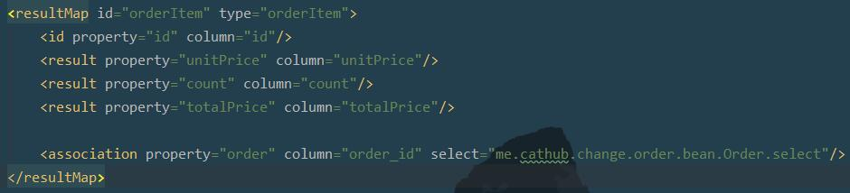

## 分库分表设计之后导致mybatis无法关联查询

#### resultMap

关联查询的时候不能设置表id

1. 执行查询:select * from orderItem_0 where id = 1; result : ..., order_id:01
2. 关联查询:select * from order_* where id=01;

order_id可以指定,但是表id无法指定。

### 解决
将所有关联查询全部调整至service层。
